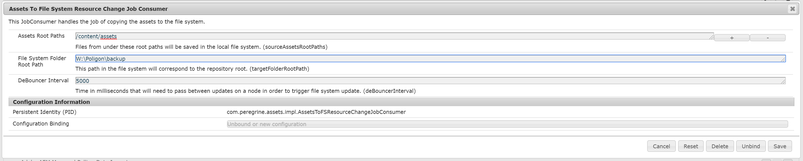

peregrine cms assets to file system
========================================================================================================================

# Introduction

Peregrine comes equipped with a service that allows a simple mapping from repository assets (files only) to the local
file system. It's task is to save files from the repo locally.

# Configuration

In order to set up your mapping one needs to configure Assets To File System Resource Change Job Consumer under
[com.peregrine.assets.impl.AssetsToFSResourceChangeJobConsumer](http://localhost:4502/system/console/configMgr/com.peregrine.assets.impl.AssetsToFSResourceChangeJobConsumer):

## Properties

- **Assets Root Paths**: Repository path to nodes that will be scanned for files to be copied to the file system.
- **File System Folder Root Path**: Local path in the file system that will contain all the final files.
- **DeBouncer Interval**: Time in milliseconds that will need to pass between updates on a node in order to trigger file
 system update. It limits the amount of possible triggers on a single node.
 
# Global Configurations

The system is supplied with a default mapping under 
[Service User Mapper](http://localhost:8080/system/console/configMgr/org.apache.sling.serviceusermapping.impl.ServiceUserMapperImpl.amended~assets)
in the form of `com.peregrine-cms.base.core:assets=assets-fs`. `/content/assets` will also have `jcr:read` privileges
granted to `assets-fs` service user. For other locations it's up to the system administrator to configure it analogously
with the paths of choice.