# Usage of Percli Hatch

This is a short introduction to **Percli Hatch** process that allows us to create a dynamic component from HTML, a JSon
Model and a little bit of Javascript.
Keep in mind that this page uses **Themclean-Flex** and its components **datalist and form** in order to showcase hatch.

## Introduction

The **Themeclean-flex** project has components defined in the **ui.apps/src/main/content/jcr_root/apps/themecleanflex/components**
as well as Sling Models in the **core/src/main/java/com/thenecleanflex/models**.
Beside the **jcr:content** node definition (.content.xml) the files are driven by the **percli hatch** process that
generates these files based on the corresponding node in the **fragments** folder.

For more information about the inner workings of hatch have a look at the [Percli Hatch Internals](internals.md).

## Fragments

The definition for the Themeclean-Flex components are placed in the **fragments** folder in the root of the project.
Later the target files are created when **percli hatch <component name>** is called.
This component folder contains these files:
* **hatch.js**: code that enhances the **template** part of the **template.vue** file based on the **template.html** file
* **model.json**: defines the Sling Model / dialog.json
* **sample[-<type>].json: component sample configurations
* **template.html**: this is the basic HTML part of the **template.vue** file
* **template.vue**: this contains the template part which is generated by **hatch** but also the script part which defines the Javasctript part of the data handling and actions

## Hatch

### Usage

The **percli hatch** command can be executed after installing **percli** like this:
```sh
npm install -g percli
```

After that you have geet help:
```sh
percli hatch --help
```
which shows this:
```
Usage: percli-hatch [options] <componentName>

Options:
  -V, --version      output the version number
  -c, --compile      compile (build) the component
  -d, --deploy       deploy to server (note, if the model.json file has been changed a full build is necessary)
  -f, --dialog       only convert the dialog
  -m, --model        only convert the model
  -v, --vue          only convert the template.vue
  -e, --sampleempty  will include the sample-empty.json, if exists
  -h, --help         output usage information
```

Now we are ready to go

### Introduction

The Percli Hatch is doing the following:

1. creates / updates the dialog.json in the component
2. updates the template.vue file here and in the JCR component's folder
3. creates / updates the <component name>Model.java file in the core
4. creates / updates the JCR content node (.content.xml) in the JCR component's folder

The most confusing part is how hatch is working with **template.vue**. It uses the **template.html** as the source for
the **&lt;template/>** part but then uses the **hatch.js** script to enhance it. The script part in the **template.vue**
is kept.

The **dialog.json** as well as the Sling Model is created or updated from the **model.json**.

## Tutorial

This tutorial introduces you to *hatch* with a new component called **mydatalist**.

### Minimal Setup

Here we want to create the most simplistic component and see what hatch creates.

First we create the folder:
```sh
mkdir fragments/mydatalist
```
**Attention**: make sure the folder name is all lowercase

Next let's create a very simple model.json file in that folder with:
```json
{
  "definitions": {
    "Mydatalist": {
    }
  }
}
```
**Attention**: The component name of **MyDatalist** must be the name of the component folder with the first letter
uppercase and the rest all lowercase otherwise the hatch will fail.

Then we create a **hatch.js** script file with this content:
```js
module.exports = {
    convert: function($, f) {
        f.wrap($, 'themecleanflex-components-block')
        f.bindAttribute($.parent(),'model','model')
        f.addElse($);
        $.parent().prepend('<div class="p-5" v-if="isEditAndEmpty">no content defined for component</div>')
    }
}
```
Then we need to create the **template.html** file to provide the HTML content. Add this content to the template.html file:
```html
<div>
</div>
```
Then we create the **template.vue** file and add this content to the file:
```html
<template>
  <themecleanflex-components-block v-if="isReady" v-bind:model="model">
    <div>
    </div>
  </themecleanflex-components-block>
</template>
```
Finally we need to copy the **template.vue** file into the components folder:
```sh
mkdir ui.apps/src/main/content/jcr_root/apps/themecleanflex/components/mydatalist
cp fragments/mydatalist/template.vue ui.apps/src/main/content/jcr_root/apps/themecleanflex/components/mydatalist
```

Then we can call hatch:
```sh
percli hatch mydatalist
```
this will generate the dialog.json in the component folder in the ui.apps and update both template.vue files.
To install the changes onto Peregrine do:
```shell
mvn clean install -P autoInstallPackage
```

This is the most basic component and does not provide anything. Anyhow it would be a good starting point when creating
a new component from scratch or when a simple component is failing and one wants to start all over to see where it broke.

### Custom Datalist

To start we take all the files from the fragments/datalist and copy them into fragments/mydatalist which will erase the previous changes.
Then open the **model.json** file and adjust the component name from:
```json
{
  "definitions": {
    "Datalist": {
      "type": "object",
```
```json
{
  "definitions": {
    "Mydatalist": {
      "type": "object",
```
Now we need to adjust the **title** of the **sample.json** file to reflect the different name of the component:
```json
{
  "title": "MyDatalist",
  "group": "",
  "model": {
    "text": "example"
  }
}
```

#### Goals

The goal of this tutorial is to be able to click on a list row which then loads the page with the details. For that we need a way to define the details page in the component's UI and add a column to the table that allows us to load the details page when clicked.

#### Custom Field

So let's start with the details page UI field. So open the **model.json** and search for **deletefunction** field. Underneath that field add the detailsPage field (the deletefunction is only here to give it context as it should already exist):
```json
        "deletefunction": {
          "type": "string",
          "x-source": "inject",
          "x-form-label": "Javascript function to call to delete rows",
          "x-form-hint": "Function must accept (tableData, activeSelections, endpointurl)",
          "x-form-type": "text"
        },
        "detailsPage": {
          "type": "string",
          "x-source": "inject",
          "x-form-type": "pathbrowser",
          "x-form-label": "Form Details Page",
          "x-form-browserRoot": "/content/themecleanflex/pages"
        },
```

This will add the field to the component's dialog.json file:
```json
        {
          "type": "pathbrowser",
          "browserRoot": "/content/themecleanflex/pages",
          "placeholder": "detailsPage",
          "label": "Form Details Page",
          "model": "detailsPage"
        },
```

In order to see the field in Peregrine do the following:

1. Start Peregrine
2. Build Peregrine, if needed, and install it with: `mvn clean install -P autoInstallPackage`
3. Build the Themeclean-Flex with: `mvn clean install -P autoInstallPackage`
4. Create a Site with Themeclean-Flex as theme
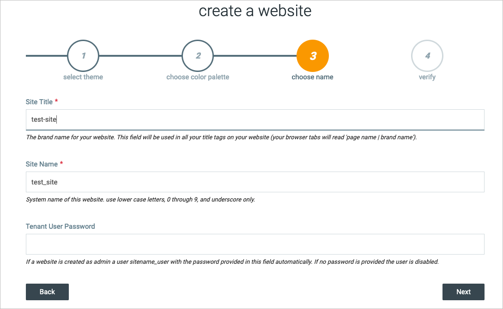
5. Click on Pages
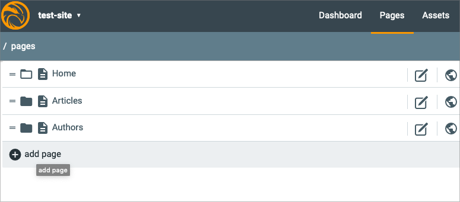
6. Click on Add Page
7. Select **Header and Footer**, click next and enter page name **my-details**, click next and then finish
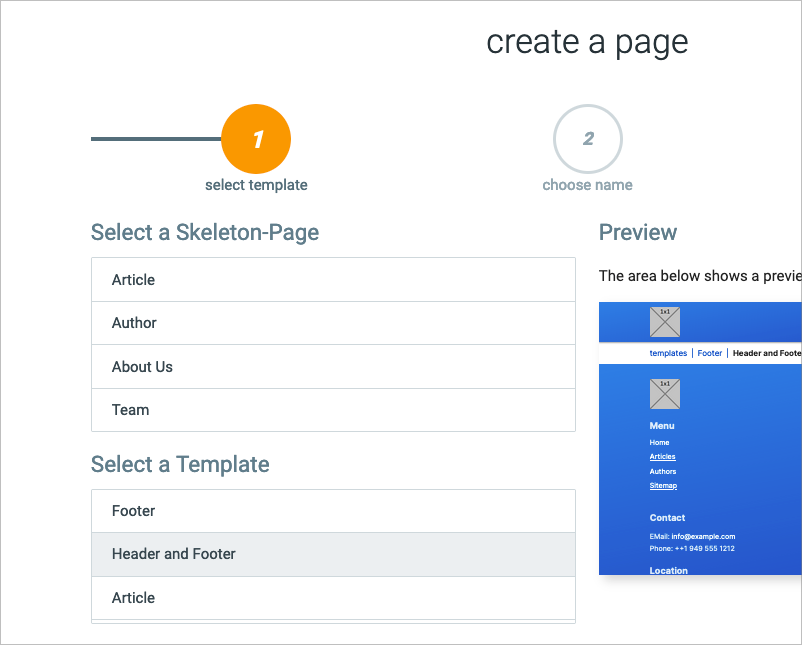
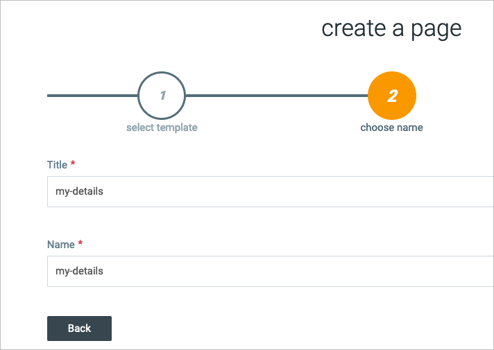
8. Click on Pen Icon to edit that page
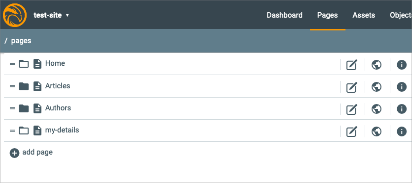
9. Scroll Down on the Components list of the right side and look for **MyDatalist**
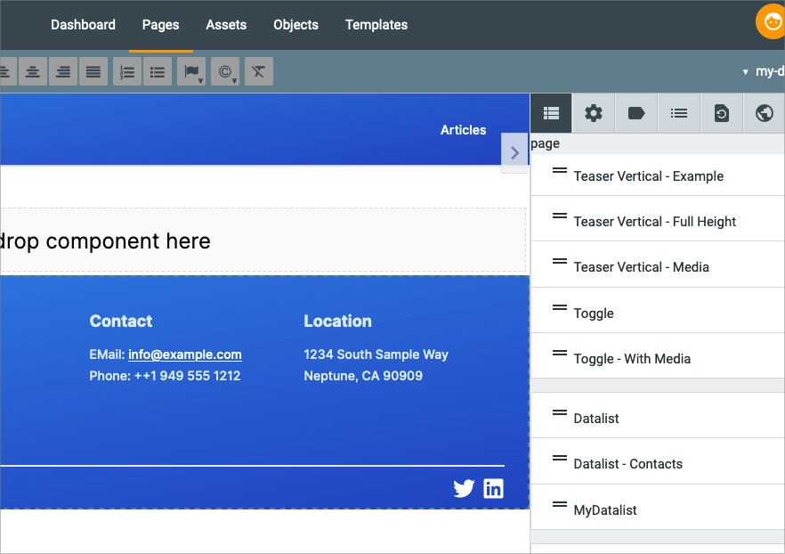
10. Drag that component onto the container on the page
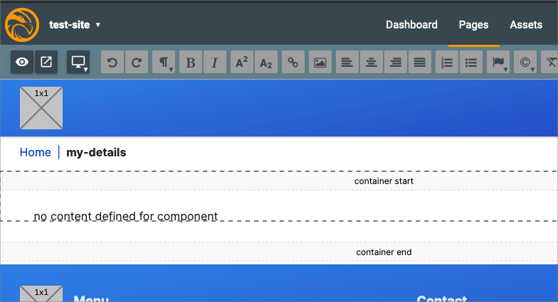
11. You will see a component with a label **no content defined for comonent**
12. Click on that component and on the right will be the fields for the component
13. Click on the **Others** dropdown box and you will see its field including our **Form Details Page**
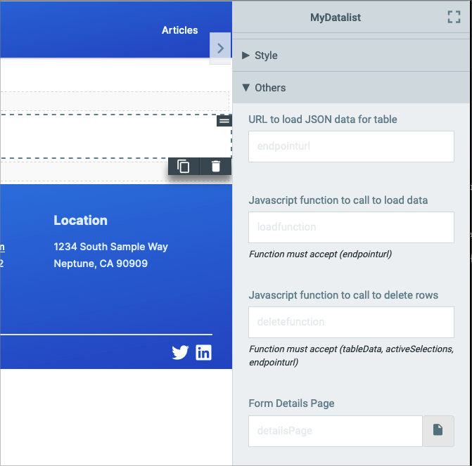
14. Click on the Page Icon on the right side of that field
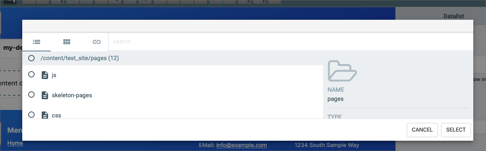
15. Peregrine will show Page Selection Dialog but because there is no details page here we can cancel that dialog

### Adding Page Details

Here we are going to add a column to the table that when clicked will redirect the user to the page selected in the detail
page property. There are the items we need to do:

* Add a Column Header
* Add a Column Item
* Make the Column Item clickable
* Add code to execute the change to the details page

**ATTENTION**: There is a reason why the action column is ahead of the content columns and not at the end of the row.
The problem is that as of now the percli hatch is not able to handle any more columns after dynamic fields of the content.

#### Add a Column Header

The Table Column Header is a very simple column header and so only needs to be added to the **template.html** file.
Keep in mind that the HTML definition contains multiple version like Desktop, Mobile and Mobile Scroll. Here we only
add the column to the desktop table:

```html
<table class="w-full border">
    <thead>
        <tr>
            <th class="action-head w-24">
...
            </th>
<!-- only add the next 3 lines -->
            <th class="header-action-column">
                <span class="header-row-action-text">My Actions</span>
            </th>
            <th class="header-item">
...
            </th>
        </tr>
    </thead>
```

After executing hatch you **template.vue** will look like this:
```html
<th class="header-action-column">
  <span class="header-row-action-text">My Actions</span>
</th>
```

#### Add a Column Item

We do the same thing but for the Table Column:
```html
<tr>
    <td class="action-item w-24">
...
    </td>
<!-- Only add the next 7 lines -->
    <td class="action-column">
        <span class="row-action">
            <svg class="w-24 cursor-pointer action-btn" focusable="false" viewBox="0 0 128 128" aria-hidden="true">
                <path d="M100 109.5c0 3.6-2.9 6.5-6.5 6.5h-75c-3.6 0-6.5-2.9-6.5-6.5v-75c0-3.6 2.9-6.5 6.5-6.5h55.1l12-12H18.5C8.3 16 0 24.3 0 34.5v75C0 119.7 8.3 128 18.5 128h75c10.2 0 18.5-8.3 18.5-18.5V42.4l-12 12V109.5z"/>
                <path d="M126.4 8.9l-7.2-7.3c-2.2-2.2-5.7-2.2-7.9 0L39.6 73.3 32 96l22.7-7.6 71.6-71.6C128.5 14.6 128.5 11 126.4 8.9z"/>
            </svg>
        </span>
    </td>
    <td class="item">
...
    </td>
</tr>
```

#### Make the Column Clickable

Now we are getting into the weeds with hatch and the **hatch.js**. What we need to do is to add a way to execute a
Javascript function when clicked. In the **hatch.js** we search for **find('td.action-item')** and after that section
and before **find('caption')** add this:
```js
const tdActionColumn = $.find('td.action-column').first()
f.bindEvent(tdActionColumn, 'click', 'loadDetailsFunction(j)');
```
After running percli hatch you will find this in the **template.vue** file:
```html
<td class="action-column" v-on:click="loadDetailsFunction(j)">
  <span class="row-action">
    <svg class="w-24 cursor-pointer action-btn" focusable="false" viewBox="0 0 128 128" aria-hidden="true">
        <path d="M100 109.5c0 3.6-2.9 6.5-6.5 6.5h-75c-3.6 0-6.5-2.9-6.5-6.5v-75c0-3.6 2.9-6.5 6.5-6.5h55.1l12-12H18.5C8.3 16 0 24.3 0 34.5v75C0 119.7 8.3 128 18.5 128h75c10.2 0 18.5-8.3 18.5-18.5V42.4l-12 12V109.5z"/>
        <path d="M126.4 8.9l-7.2-7.3c-2.2-2.2-5.7-2.2-7.9 0L39.6 73.3 32 96l22.7-7.6 71.6-71.6C128.5 14.6 128.5 11 126.4 8.9z"/>
    </svg>
  </span>
</td>
```

Even though we did not add a click function to the HTML in the template.html the hatch.js will add this for the field
for us. There is one more thing we have to look into. When a column is selected then the background should change which
we do with this added line in the hatch.js file:
```js
const tdActionColumn = $.find('td.action-column').first()
f.addStyle(tdActionColumn, 'background', "active[j] ? 'var(--color-red-500) !important' : ''")
f.bindEvent(tdActionColumn, 'click', 'loadDetailsFunction(j)');
```
Which will genereate this template.vue part:
```html
<td class="action-column" v-bind:style="`background:${active[j] ? 'var(--color-red-500) !important' : ''};`"
v-on:click="loadDetailsFunction(j)">
  <span class="row-action">
    <svg class="w-24 cursor-pointer action-btn" focusable="false" viewBox="0 0 128 128" aria-hidden="true">
        <path d="M100 109.5c0 3.6-2.9 6.5-6.5 6.5h-75c-3.6 0-6.5-2.9-6.5-6.5v-75c0-3.6 2.9-6.5 6.5-6.5h55.1l12-12H18.5C8.3 16 0 24.3 0 34.5v75C0 119.7 8.3 128 18.5 128h75c10.2 0 18.5-8.3 18.5-18.5V42.4l-12 12V109.5z"/>
        <path d="M126.4 8.9l-7.2-7.3c-2.2-2.2-5.7-2.2-7.9 0L39.6 73.3 32 96l22.7-7.6 71.6-71.6C128.5 14.6 128.5 11 126.4 8.9z"/>
    </svg>
  </span>
</td>
```
which did add the **v-bind:style** part to the table column (<td/>).

#### Load the Page Details

We added the call of the Javascript function **loadDetailsFunction(j)** to the column and now we need to define that
function which is done in the **script** section of the template.vue. So ope that file and search for **loadData** in
the **methods** part:
```js
methods: {
...
loadData: function(data) {
...
},
loadDetailsFunction: function(id) {
  if(this.model.detailsPage && this.model.detailsPage !== '') {
    $peregrineApp.loadContent(this.model.detailsPage + ".html/" + id);
  }
},
deleteAction: function() {
...
```

When the function **loadDetailsFunction** is called it will check if the details page is configured and if it will use
the **$peregrineApp.loadContext()** nethod to load that detail page. For that we add the HTML extension and the row
index as suffix.

**Note**: because there is no page that will take a suffix to load existing data we cannot test it, yet.

### Test Setup and Execution

Even though our component is ready it is missing two crucial parts:

* A Details Page
* Details Data

With a Details Page we can also add data into the Browser's storage with the **formsapp.js** script.

#### Details Page

To create a Details Page we can use the **Forms Contact** sample:

1. Go to the Pages page
2. Click on the 'add page' to create a new page
3. Select **Header and Footer** template, click next and enter page name **my-form-detail**, click next and then finish
4. Click on the Pen Icon to edit the **my-form-detail** page
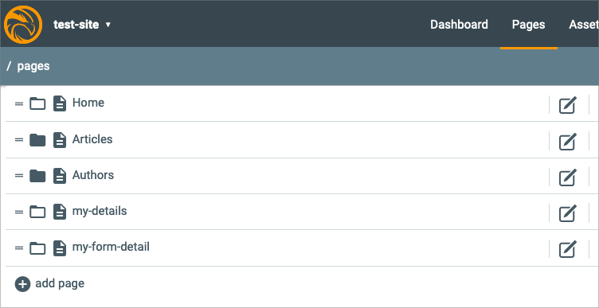
5. On the right side sroll down to the **Form - Contact** component
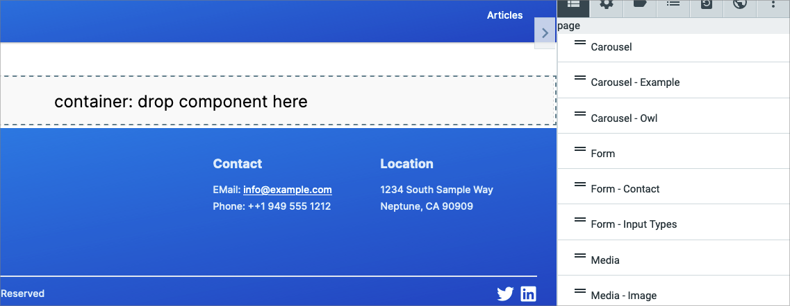
6. Drag that component onto the container on the page
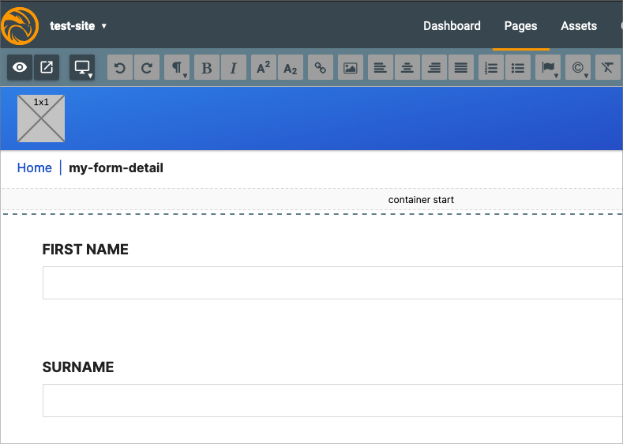
7. Click on the component to bring up the UI details on the right
8. Enter the following values:
   1. Form submit endpoint URL: **list**
   2. Javascript function to call on submit: **$formsapp.save**
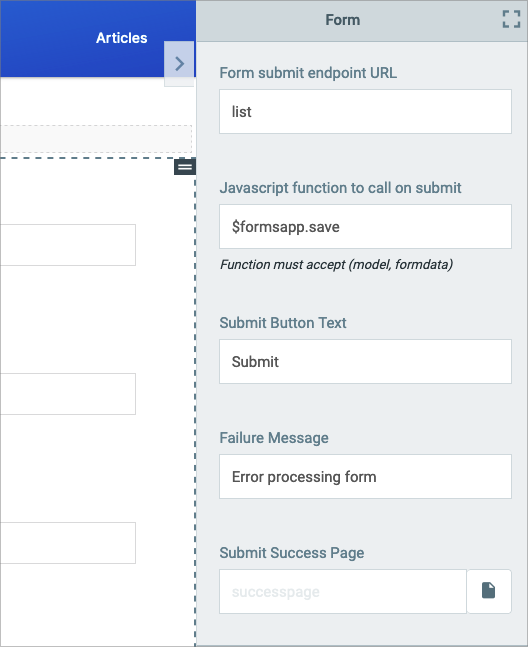
      1. Submit Success Page
         1. Click on the Sheet Icon to the right of the input field
         2. Check **my-details** in the dialog
         3. Click on the **Select** button to save it
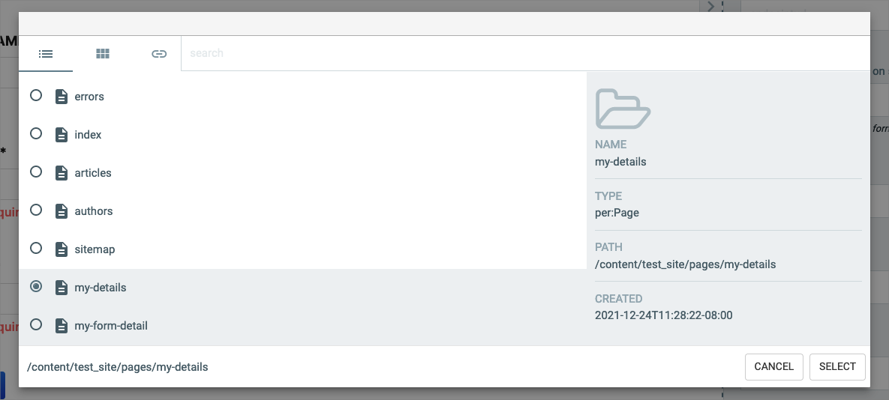
9. Click on the **Check** button on the bottom right to save the changes
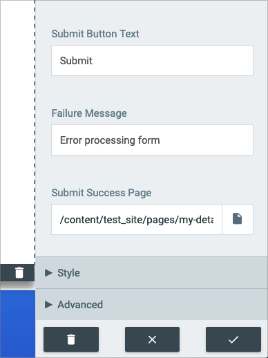

#### Enter Details Data

Now we are ready to enter data:

1. Go back to the Pages page
2. Click on the **Eye** icon of the **my-form-details** page to view the page
3. Enter values into all fields
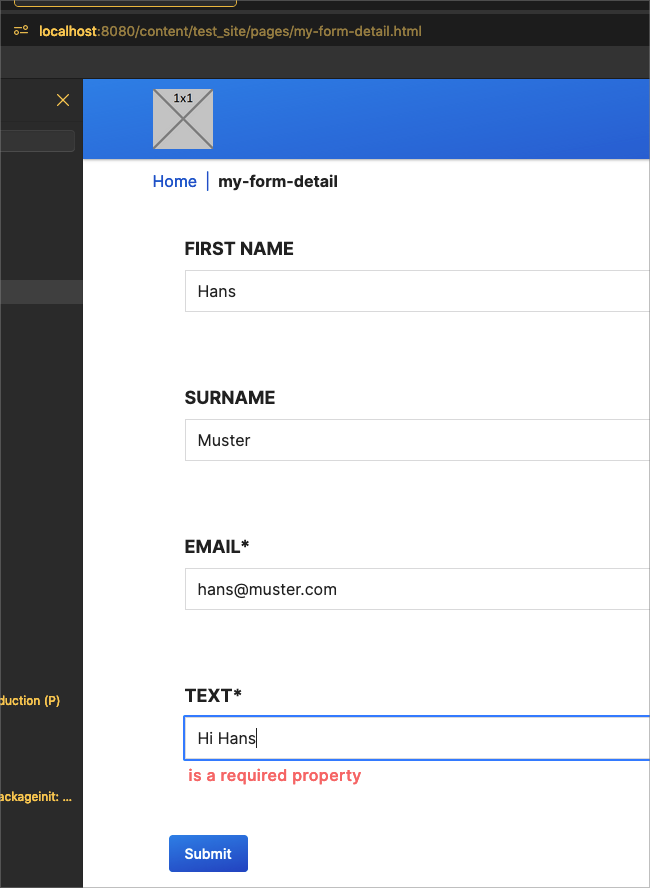
4. Click **Submit** button
5. The page will change to the **my-details** page but because this is not correctly setup it is empty

#### Adjust the Details Page

We are now ready to finish the setup to test our details page:

1. Go back to the Pages page
2. Click on the **Pen** icon of the **my-details** page to edit it
3. Click on the **Mydatalist** component
4. Click on the **Other** dropdown tab
5. Enter these values:
   1. URL to load JSON data for table: **list**
   2. Javascript function to call to load data: **$formsapp.load**
   3. Javascript function to call to delete rows: **$formsapp.delete**
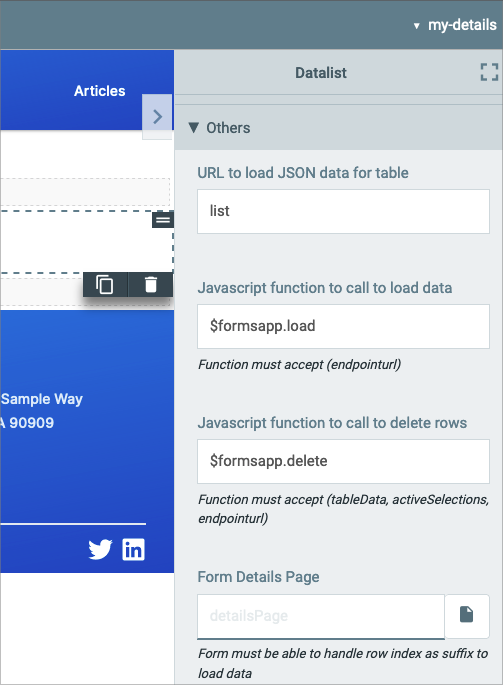
   4. Form Details Page:
      1. Click on the Sheet Icon to the right of the input field
      2. Check **my-form-detail** in the dialog
      3. Click on the **Select** button to save it
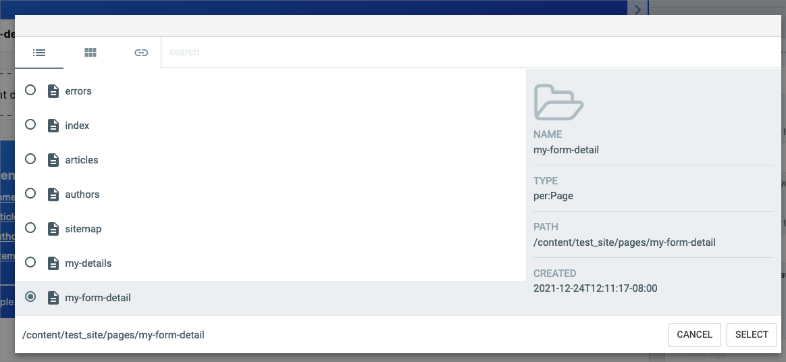
   5. Below is the **Table Configuration**, click on the **+** button to add a column
      1. Add Column Header: **Email**, Data Value: **email**
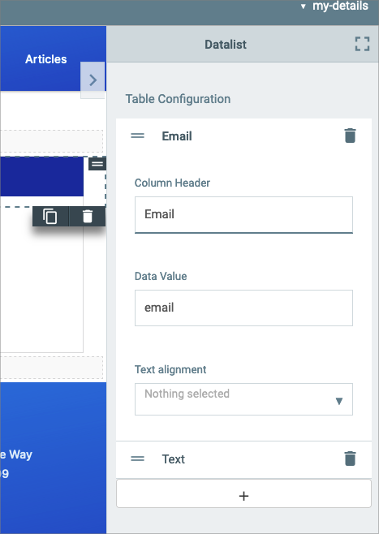
      2. Click once more on the **+** button, add Column Header: **Text**, Data Value: **text**
   6. When adding column you will see the data appear on the component
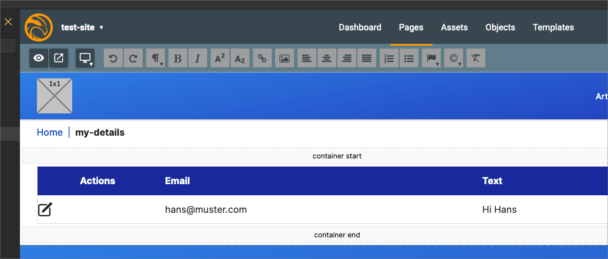
6. Click on the **Check** button on the bottom right

#### Final Test

Now we are ready to test our little application:

1. Go to the Pages page
2. Click on the **Eye** icon of the **my-details** page
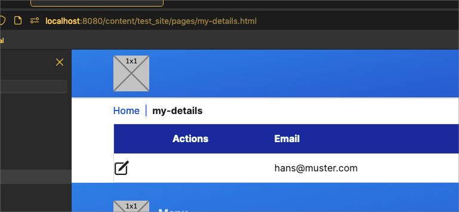
3. Click on the **Pen** icon in the row
4. You will see the details page with the actual data
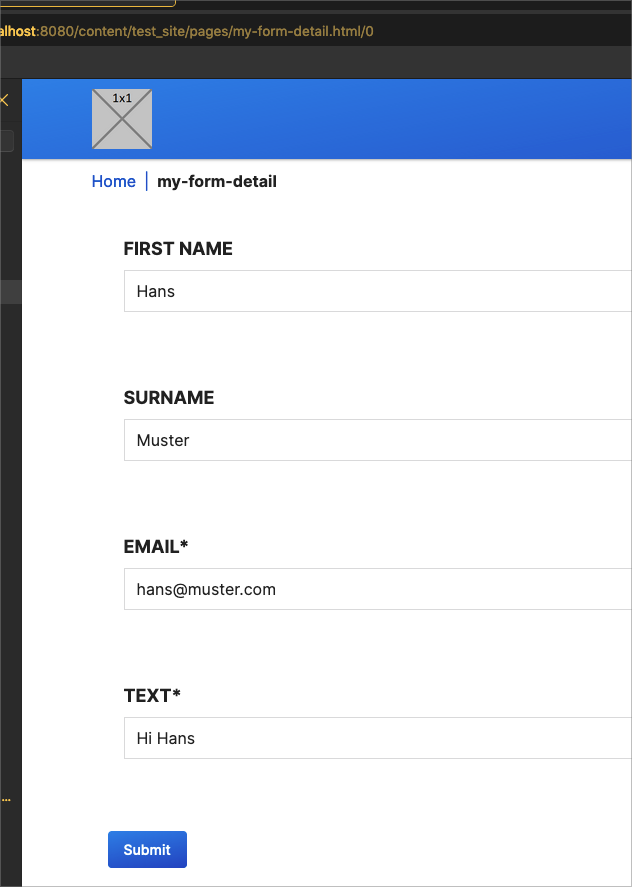
5. Change the **email** address to **john@sample.com**
6. Click on **Submit** button and you will go back to the **my-details** page and see two rows
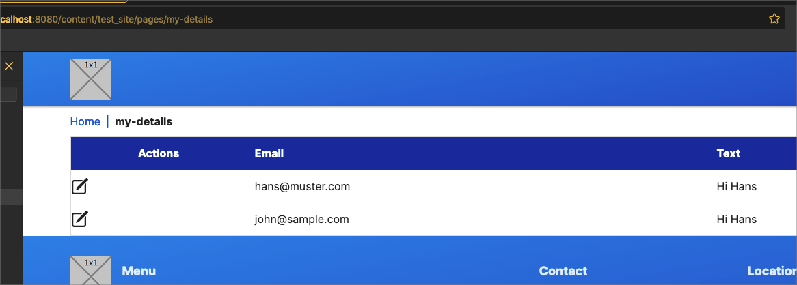

**Note**: at the moment the **formsapp.save** will create a new record everytime it is called and does not update
an existing record. This is the reason why we see two entries instead of an update one.

#### Conclusion

As we saw in this simple tutorial the **template.html** is providing the basic HTML, the **template.vue** provides the
Javascript and the **hatch.js** provides additional properties and page customizations depending on the model
configuration. The **model.json** provides the fields that is set during the component editing and then used in the
template.vue during rendering.