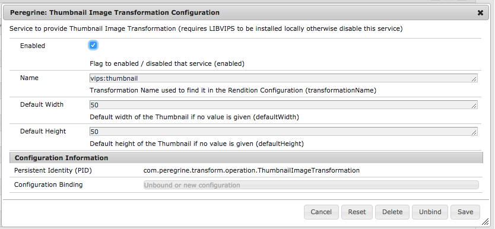
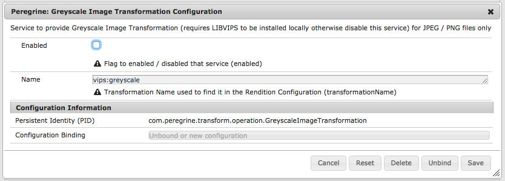
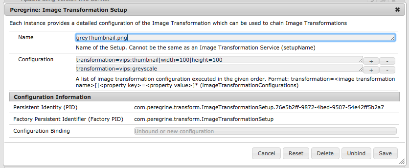

peregrine cms renditions
=====

# Introduction

Peregrine supports Asset Renditions out of the box but it requires
that **VIPS** is installed in order to make it work. VIPS is supported
on Windows, Mac and Linux.

# Installing VIPS

Unless you are running the official Peregrine Docker image, VIPS needs to 
be installed manually as it requires installation of native OS code. 
To learn more on how to install **libvips**:

[libvips Wiki Page](https://github.com/jcupitt/libvips/wiki)

## Linux (Ubuntu)

If you have an apt-get based Linux system, run the following command:


```
$ sudo apt-get install libvips libvips-dev libvips-tools -y
```

## Mac OS X

**Homebrew** seems to be the easiest installation
(https://github.com/jcupitt/libvips/wiki/Build-for-macOS).

## Windows

TODO

## Validate VIPS Installation

Please make sure htat VIPS is working before more on:

    vips --version

which should yield something like this:

    vips-8.5.5-Tue May 16 10:44:23 BST 2017

# Image Transformation Structure

The basic image handling is done by the **Image Transformation** which are referenced by their
name. That should start with a prefix like **vips** to keep them apart from other image transformation
services added in the future. These classes are what is either executing or calling the image
handling programs. They **must be enabled** for VIPS in order to be used otherwise the rendition
will fail.

On the other hand we have the **Image Transformation Setup**s which are the configuration of the
image handling for a particular purpose like creating a Greyscale Thumbnail in PNG format. Each
of them are referenced by its name and the extension of the name indicate the target image type
like **.png** or **.jpeg**. Each Setup must provide a least one **Configuration** which contains
the name of the **Image Transformation** and optional parameters.

Under the hood the **Image Transformation Setup** provides a list of **Image Transformation Configuration**s
which is then used to obtain the **Image Transformation** from the **Image Transformation Provider**.
Both together (Image Transformation and Image Transformation Configuration) are then used to
configure and execute the image handling.

# Image Transformation Configuration

Peregrine provides these Image Transformation Services:

* Thumbnail: creates a smaller version the original image with or without cropping
* Greyscale: creates a grey image of the original image

All services in Peregrine are disabled by default because
Peregrine cannot assume that VIPS is installed.

### Thumbnail Configuration

|Name|Parameter|Required|Type|Default|Description|
|:---|:--------|:-------|:---|:------|:----------|
|Enabled|enabled|yes|boolean|true|Flag to indicate if the Service can be used or not|
|Name|name|yes|String|vips:thumbnail|Name of the Image Transformation used for the Setup|
|Default Width|defaultWidth|no|int|50|Default Width in pixels of the target image|
|Default Height|defaultHeight|no|int|50|Default Height in pixels of the target image|



### Greyscale Configuration

|Name|Parameter|Required|Type|Default|Description|
|:---|:--------|:-------|:---|:------|:----------|
|Enabled|enabled|yes|boolean|true|Flag to indicate if the Service can be used or not|
|Name|name|yes|String|vips:greyscale|Name of the Image Transformation used for the Setup|



# Image Transformation Setup

Image Transformations are the basic building blocks but the Image Transformation Setup is combining the
Image Transformation into the final rendition actions. They also define the output format with its extension
as well as the actual parameters of the image transformation if provided.
For a single Image Transformation you still need to create an Image Transformation Setup just with a single
Image Transformation. That said you can create multiple Image Transformation Setups for various image types
or image sizes etc.

The configuration of an Image Transformation Setup: **com.peregrine.transform.ImageTransformationSetup**:

|Name|Parameter|Required|Type|Default|Description|
|:---|:--------|:-------|:---|:------|:----------|
|Name|name|yes|String|none|Name of the Image Transformation Setup. You need to provide an extension for the target image type|
|Configuration|imageTransformationConfiguration|yes|String|none|List of Image Transformation in the format: transformation=&lt;transformation name>[\|parameter name=parameter value]*|

For example if there is a need for a greyscale thumbnail you can execute a greyscale and then a thumbnail
to generated the desired image.



# Renditions

Renditions are created and stored under the asset node's **renditions** node which the name of the
image transformation setup. The API call to obtain (and create a rendition if not already there) is

    &Lt;URL to the Asset without extension>.rendition.json/&lt;image transformation name>

So to create an thumbnail on the asset **/content/test/assets/test.png** you use the following URL:

    /content/test/assets/test.png.rendition.json/thumbnail.png

**GET** and **POST** HTTP Methods are supported for this call and work the same way.
