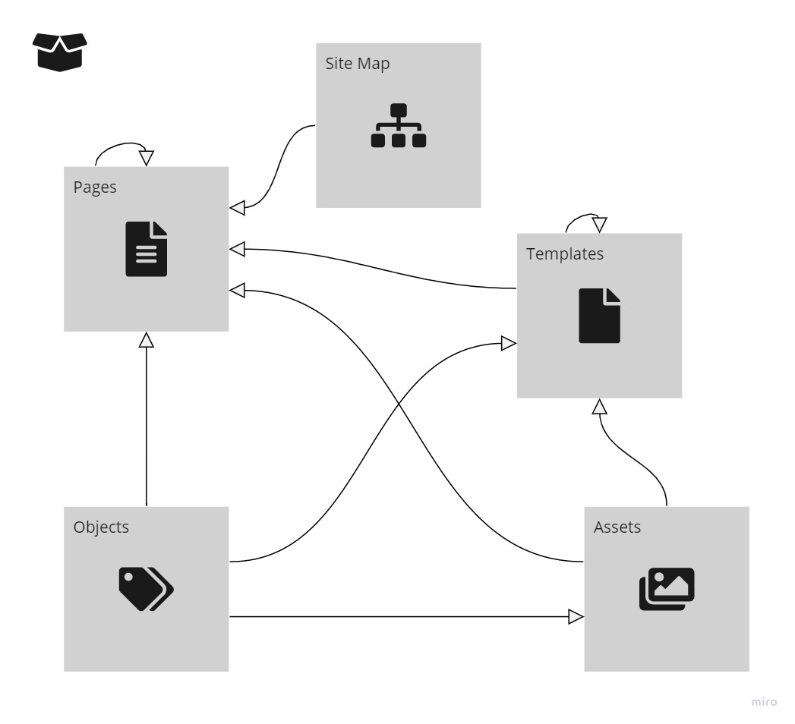
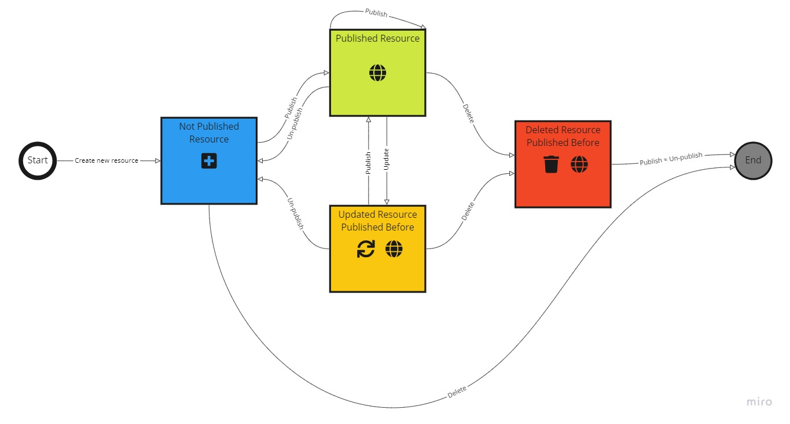
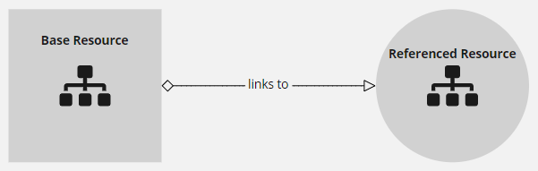
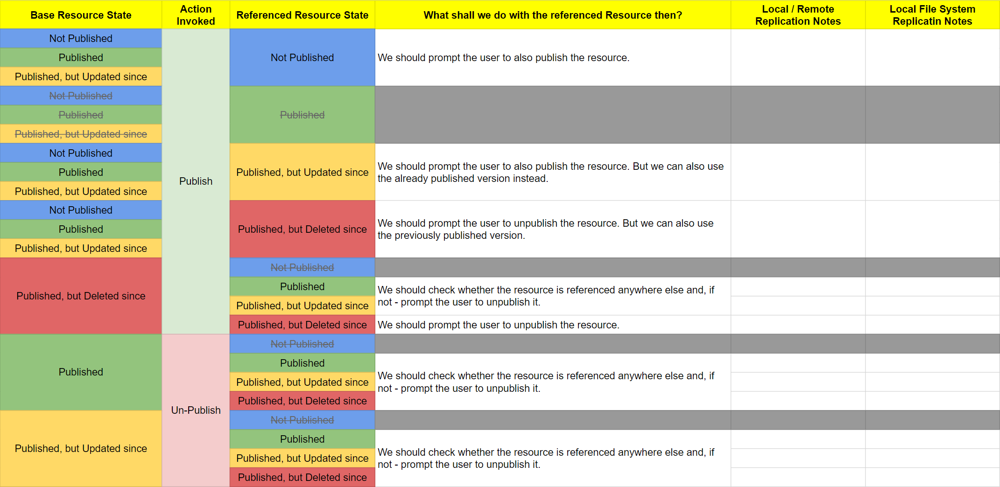
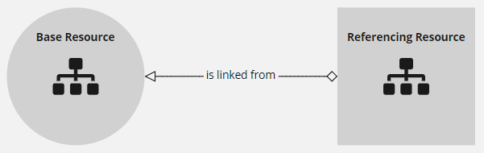
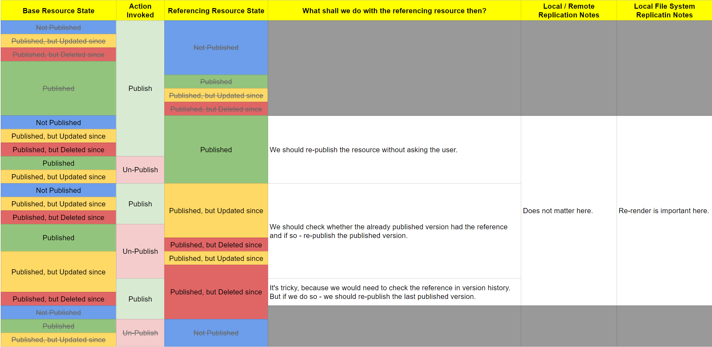
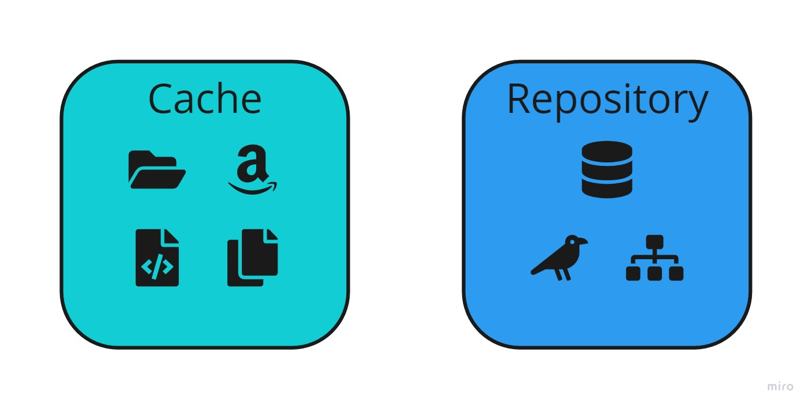

# Peregrine Replication Use Cases

We have to establish nomenclature here and some simplifications first. The topic is quite complex and
we will get lost quickly without it.

# Introduction

Let's look at the Peregrine Site content structure and the dependencies inside of it first:

We have to realize one thing that should simplify things significantly. Namely, it actually
should not matter to us exactly what type of resource we are discussing in terms of
distribution / replication / publishing / un-publishing. In this regard they are more or less the same.
They're just resources in the system. We render those resources somehow. Each resource can reference
a bunch of other resources in order to render itself properly for the client. The figure above presents
the dependencies in a graph form to represent the idea. It might actually not make much sense to describe
here how we deal with all of those relations, that should most likely be an implementation detail.
We will thus focus on an abstract notion of a **resource** instead and assume they might reference
each other in a way that might impact the rendering and thus cross-cut the replication subject.

On the other hand though we will treat the Site as a separate entity since it is in a different league
as it acts as a container to other resources.

# The Use Cases

Let's start with

## Root Site
* [Replicate new Root Site](root-site-new.md)
* [Replicate updated Root Site](root-site-updated.md)
* [Un-publish Root Site](root-site-unpublished.md)
* [Replicate deleted Root Site](root-site-deleted.md)

## Resource

In order to conquer the subject of abstract resource replication we have to start with its life cycle:

This is where all the complexity comes from as the above possible states of resources intertwine heavily
with the previous site graph. Most, if not all, of our _edge cases_ will come from the following abstract
scenario:

We want to perform an action `A` on a resource `R` that will move it from state `Sr0` to state `Sr1`.
`R` references another resource `P` that is in state `Sp`.
`R` is also referenced by yet another resource `Q` that is in state `Sq`.

Let's address this below and first focus on a simple happy path for each action,
where we use a placeholder for the above:

* [Replicate new Resource](resource-new.md)
* [Replicate updated Resource](resource-updated.md)
* [Un-publish Resource](resource-unpublished.md)
* [Replicate deleted Resource](resource-deleted.md)

Whenever we speak of associated resources in the above scenarios, there are many combinations of the state
of base resource, action and referenced / referencing resource that have to be considered for activation
to keep the published version in good shape. We have the following
[combinations listing](https://docs.google.com/spreadsheets/d/1IYNtmZCszbP1S9TZV4ZzlinLnh7zlsnzsSlnYpwC3Bc) to consider:
### Referenced Resource

### Referencing Resource

## Page Tree
* Do we want to publish parents of a page when we publish the page? Or just mock the path from the root to it?

## Specific Resource Type Use Cases
* [Replicate new Sitemap](sitemap-new.md)
* [Replicate updated Sitemap](sitemap-updated.md)
* [Replicate deleted Sitemap](sitemap-deleted.md)

# Implementation Notes

## Replication Types
We have to note that there are two basic replication strategies in Peregrine:

Repository is quite safe in most cases since the pages can be rendered on the fly.  
Much more attention has to come to the cache-like replication options, i.e. those, where we store
final renderings of the replicated resources. A lot can go wrong if we don't handle the references
properly.

## Versioning Role
We should version the published resources and use those versions to render published resources that depend on them.
Let's note though, that it will be much more feasible to simply keep an up-to-date published tree of resources
than to use the versions directly.

