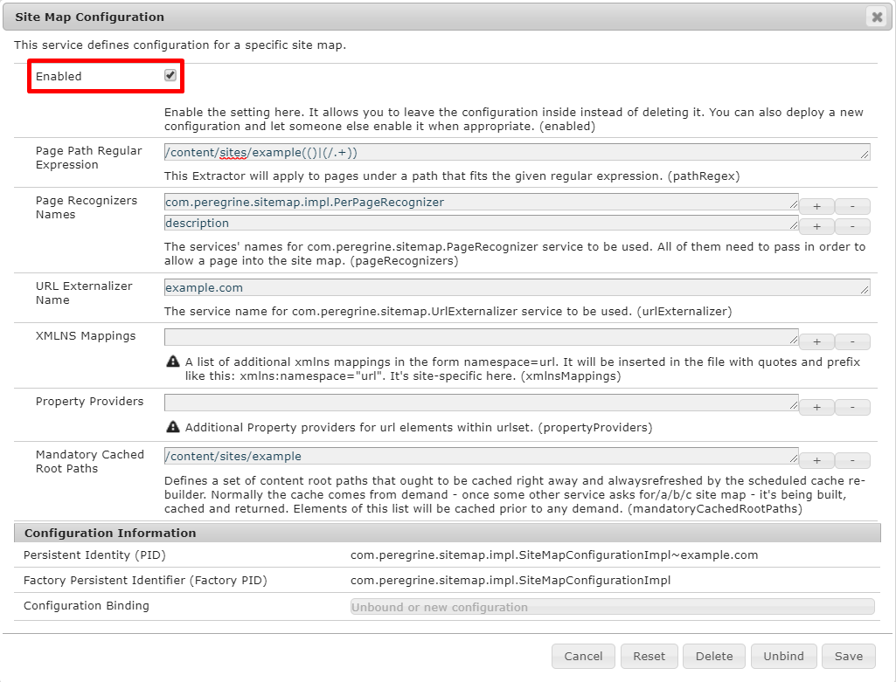
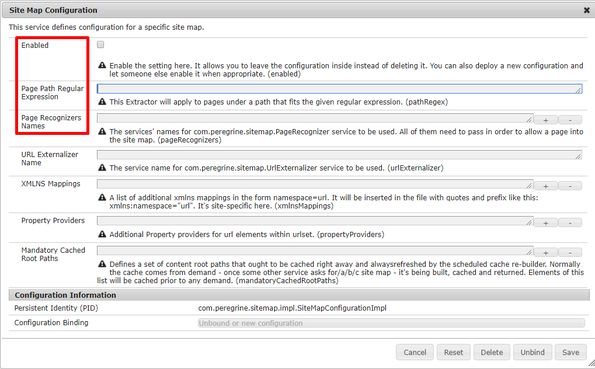
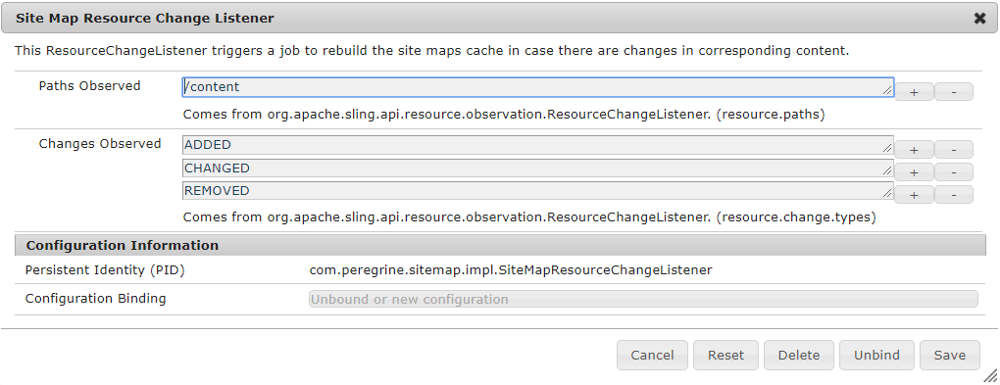
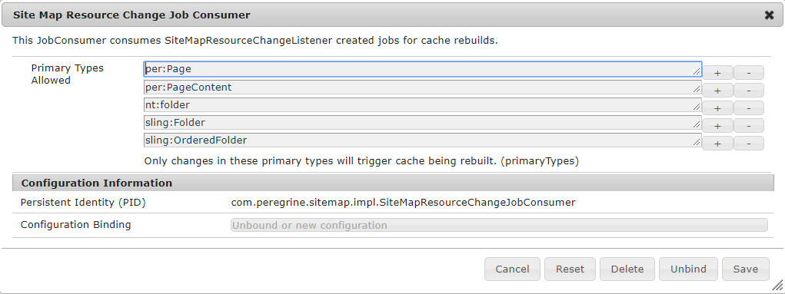
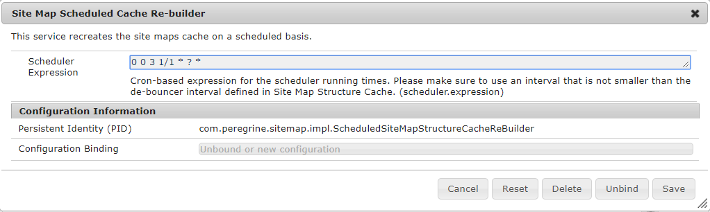
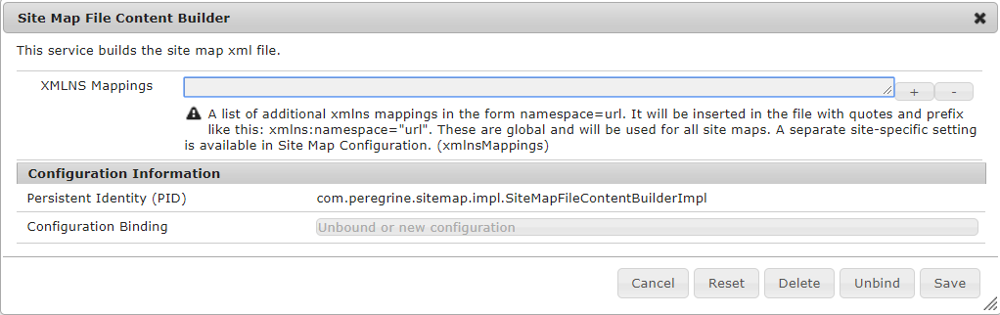
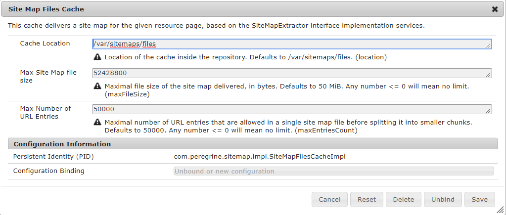
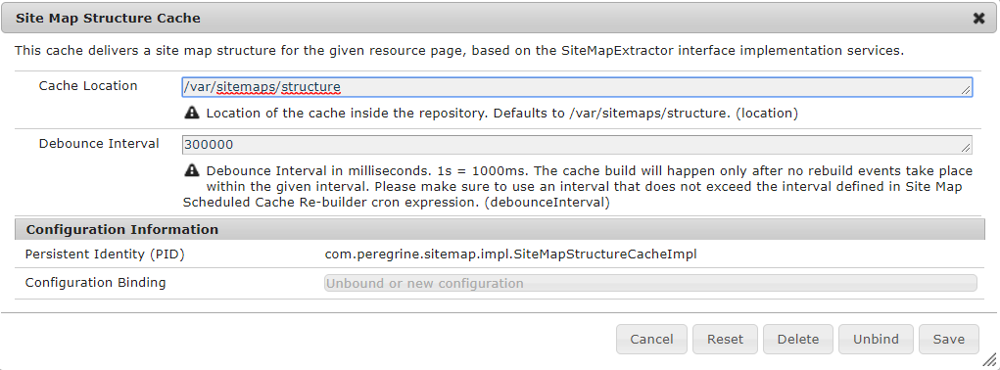

peregrine cms site maps
========================================================================================================================

# Introduction

Peregrine supports an extensive `sitemap.xml` rendition and caching mechanism. It supports cache rebuilds triggered by
resource changes and time-based via a cron-like expression. It's easily configurable and highly customizable by plugins. #

# Known Issues

- [Permission for `/var/sitemaps/` is not granted properly (#295)](https://github.com/headwirecom/peregrine-cms/issues/295)

## Example

The default installation contains
an example configuration for the site map of [/content/example/pages](http://localhost:8080/content/example/pages/index.html).
It's disabled by default though. One needs to enable it inside the appropriate
[com.peregrine.sitemap.impl.SiteMapConfigurationImpl](http://localhost:8080/system/console/configMgr/com.peregrine.sitemap.impl.SiteMapConfigurationImpl~example.com)
configuration:

It will be then available under [/content/example/pages/index.sitemap.xml](http://localhost:8080/content/example/pages/index.sitemap.xml).
The cached file will reside under [/var/sitemaps/files/content/example/pages](http://localhost:8080/bin/browser.html/var/sitemaps/files/content/example/pages)
and the backing structure - under [/var/sitemaps/structure/content/example/pages/index/jcr:content](http://localhost:8080/bin/browser.html/var/sitemaps/structure/content/example/pages/index/jcr%3Acontent).
Those are created on demand, if not yet present once requested. Otherwise - the content saved in cache gets served.
Additionally under [/content/example/pages/index.sitemap.txt](http://localhost:8080/content/example/pages/index.sitemap.txt) one
will find an Apache Rewrite Map.

# Site Map Configuration

In order to set up your own site map you need to add a new configuration [com.peregrine.sitemap.impl.SiteMapConfigurationImpl](http://localhost:8080/system/console/configMgr/com.peregrine.sitemap.impl.SiteMapConfigurationImpl):

The marked properties are mandatory for proper effect to take place.

## Mandatory Properties

- **Enabled**: simple `true` / `false` value. Must be checked for the configuration to work.
- **Page Path Regular Expression**: this value represents the regular expression used to create a [`pattern`](https://docs.oracle.com/javase/8/docs/api/java/util/regex/Pattern.html)
that allows to recognize which page paths fall into this configuration. Since there might be many separate instances of
this factory configuration it is up to the administrator to configure the expressions in a way that they do not overlap.
No priority is not guaranteed here. The regex syntax follows the rules from [Java](https://docs.oracle.com/javase/8/docs/api/java/util/regex/Pattern.html)
language.
- **Page Recognizers Names**: It's actually *not mandatory* per se, but it is highly recommended. Since any Sling
`resource` can potentially be treated as a web page, when rendered with `html` extension, we need a way to tell the
site maps engine which ones we interpret as such. To include only peregrine compatible pages one can simply use
`com.peregrine.sitemap.impl.PerPageRecognizer` as the only name in this field. Since multiple entries are allowed - all
of them entered will be checked and only if all pass - the `resource` will be recognized as a valid page and allowed in
the site map (`boolean` `and` is used to connect conditions). Read the part on `com.peregrine.sitemap.PageRecognizer`
for customization options.

## Optional Properties

- **URL Externalizer Name**: by default the system will use `/etc/map` path shortening and externalization
(`com.peregrine.sitemap.impl.EtcMapUrlExternalizer`). One can instead configure their own `UrlExternalizer` and provide
it's name in the field. Read more in the part on `com.peregrine.sitemap.UrlExternalizer` below for tips on how to
customize it.
- **XMLNS Mappings**: a list of `xml` namespace mappings to be included in the document root. Items need to be in form
`key=value` where the `xmlns:` prefix is not needed (will be added by the system). These mappings will only work for
this configuration, not globally. There is a separate global config if we want all `sitemap.xml` files to have special
mappings for all instance configurations.
- **Property Providers**: a list of additional `PropertyProvider`s' names to plug in additional properties of a page
inside the site map. By default, the system provides:
    - `loc`: by means of `urlExternalizer` from above,
    - `priority`: from `priority` property of the page (`com.peregrine.sitemap.impl.PriorityPropertyProvider`),
    - `changefreq`: from `changefreq` property of the page (`com.peregrine.sitemap.impl.ChangeFreqPropertyProvider`),
    - `lastmod`: from `jcr:lastModified` or `jcr:created` property of the page
    (`com.peregrine.sitemap.impl.LastModPropertyProvider`).
One can easily plug additional properties and override the listed ones by means of implementing custom extension of
`come.peregrine.sitemap.PropertyProvider` `interface`. Details follow below in a separate section.
- **Mandatory Cached Root Paths**: The system provides means of a regular cache rebuilding. It's globally configurable
and described below in details. The paths given here will be included for such perpetual / regular update.

## Custom Plugins

The system allows custom plugins to be referenced by their name. The name can be predefined and static or configurable
- it all depends on the requirement from implementer's perspective. All named plugins `extend` the `interface`
`come.peregrine.sitemap.HasName` that provides a default `getName()` implementation, but can be overridden to e.g. allow
the administrators to set custom names for `factory` based configurations. An example would be
`com.peregrine.sitemap.impl.DirectPropertyProvider`. All the plugins below rely on `HasName` to operate.

## Page Recognizer

`com.peregrine.sitemap.PageRecognizer` exposes a single method `boolean isPage(Page candidate)` that should return `true`
if we want the `candidate` to be classified as a `page`. An easy way to define a custom `PageRecognizer` is to `extend`
`PageRecognizerBase` `class` that delivers basic attributes that are usually associated with a `page` in the **Sling**.

## URL Externalizer

`com.peregrine.sitemap.UrlExternalizer` exposes two methods `String map(Resource page)` and
`String map(ResourceResolver resourceResolver, String url)`. But actually it's usually enough to simply `extend`
the `abstract` `class` `UrlExternalizerBase` and only have to `implement` the latter. The resulting `String` should
simply be an externalized URL for the given `page` / internal `url`. Example implementations are
`com.peregrine.sitemap.impl.EtcMapUrlExternalizer` and `com.peregrine.sitemap.impl.PrefixAndCutUrlExternalizer`.

## Property Provider

`com.peregrine.sitemap.PropertyProvider` exposes two methods that need to be implemented in order to introduce our new
custom properties to be extracted per site map entry:
- `String getPropertyName()`: simply returns the name of the property to be added to `<url>` element inside `sitemap.xml`
as an element / tag (and also as a cached node inside the structured cache - more on this later),
- `Object extractValue(Page page)`: should return the extracted value of the property. In the simplest version it can
return a `String`. If it's not a `String` - a `toString` result will be used. But not all properties are always flat.
For that reason one can also return a `Map` object and nest other maps within it. In such case the mapping between the
extracted `Map` and `sitemap.xml` file is rather obvious (same for structured cache).

# Global Configurations

The system should work as-is, given a concrete site map configuration is provided. One can though customize its aspects
described below.
      
## Site Map Resource Change Listener

It's a fairly simple and standard `service` with well known standard configuration options for a
[`ResourceChangeListener`](https://sling.apache.org/apidocs/sling9/org/apache/sling/api/resource/observation/ResourceChangeListener.html):

It's then creating a [`Job`](https://sling.apache.org/apidocs/sling9/org/apache/sling/event/jobs/JobManager.html#addJob-java.lang.String-java.util.Map-)
that is consumed by:

## Site Map Resource Change Job Consumer

This `service` consumes jobs triggered by resource changes in the system repository.

Its only configuration option is the list of `jcr:primaryType`s that, when changed, will trigger a cache rebuilding.
It's one of 2 `service`s that can do so, the other being:

## Site Map Scheduled Cache Re-builder

The scheduled cache re-builder triggers a rebuilding process based on the given `cron` expression. Every time the time
meets the expression criteria - all the mandatory paths described above are scheduled for rebuilding.

It is important not to set the expression interval here in conflict with the `debounceInterval` below. The `cron`
interval here must be bigger.

## Site Map File Content Builder

With the file content builder one can define global `xmlns` mappings that will go to all `sitemap.xml` files in addition
to those described above for an instance site map configuration.

## Site Map Files Cache

Site Map Files Cache configuration page speaks for itself:

      
## Site Map Structure Cache

Site Map Structure Cache is the heart of site maps system.

**Cache Location** configuration option is self-explanatory. The **Debounce Interval** limits the amount of possible
cache rebuilding triggers on a single node / site. Imagine that an author edits pages within a site. Change actions
might be happening quite often. But we want to start the rebuilding process only once they stop. So let's say - when
nothing happens for 5 minutes - we assume the changes are done and we can rebuild stuff.

One can reference `com.peregrine.sitemap.SiteMapStructureCache` `service` in their code and take advantage of the site
map entries information cached. By implementing custom `com.peregrine.sitemap.SiteMapStructureCache.RefreshListener` and
subscribing it to `SiteMapStructureCache` we also get an option to consume the changes at the same time when they are
committed.