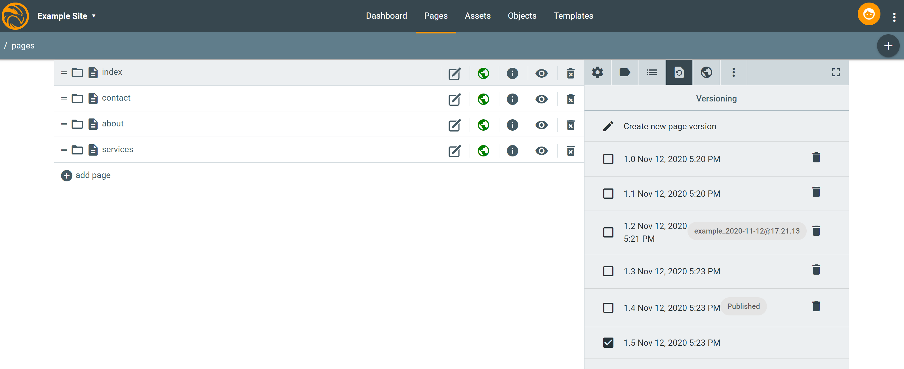

Versioning in Peregrine CMS
=====

Peregrine provides versioning for the resources (page / asset / object / template) stored in sites.

# User Interface

The UI panel is available in a separate tab after pressing the info button of a given page / asset / object / template:

The image above shows a list of versions of the _index_ page in the _example_ site. Some of them are created
manually by the user via a dedicated action button. Two stand out though.

The first one is labeled with `example_2020-11-12@17.21.13` badge. It's been automatically created after starting
the `Site Setup Replication` action.

The other is labeled with `Published` badge. It's been automatically created within the latest publish / activate /
replicate action.

Only one version of a given resource can have a particular label, so `/content/example/pages/index` can have only one
`Published` label. On the other hand a different resource can have a version with the same label, so
`/content/example/pages/index` can also get a `Published` badge at the same time and no conflict occurs. As a matter
of fact it's actually a very useful property of the tool, which we'll see below.

The user gets to control versions manually for their benefit. One can create a custom version, delete it and restore it.

# API & Tools

Based on the versioning, Peregrine provides a special `ResourceResolver` wrapper that allows the developer
to transparently view a snapshot of the repository in Sling terms.
`com.peregrine.versions.VersioningResourceResolver` is an implementation of Sling's `ResourceResolver` interface that
takes a version `label` as input to expose stuff under `/content/` in the form preserved with the given label
on the version of the resource.

Programmatically one will create an instance via `VersioningResourceResolver(ResourceResolver, String)` constructor.
For most regular applications there is another way additionally. `VersioningRequestFilter` is looking for the following
property of a `request`:

`x-per-version-label`

Its value is the label that `VersioningResourceResolver` will look for in the resource version history. One can set it
to e.g. `Published` or the other type described above.

The property can be passed in 3 ways:
* as a `request` header,
* as a `Cookie`,
* as a `request` attribute.

The second option allows for a consistent view of the given state of the site, when applied in the browser manually.
We do not provide any UI for the user to use it, it's an advanced option for the developers only.

Due to how Sling processes requests it's not always reliable to trust `VersioningRequestFilter`. This remark applies
mainly to custom mocks wrapped around `SlingHttpSerlvetRequest`. It's all good for the OotB implementations.

Additionally, the direct way is the only one in case of e.g. services or jobs where a `request` is not available.
