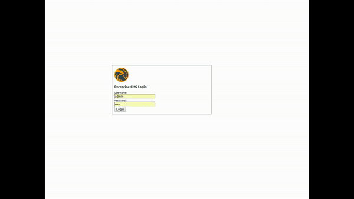

peregrine cms
=====

# Introduction

Peregrine CMS (PER:CMS) is a Head Optional, API First Content Management System based on Apache Sling. It uses VueJS
 for the administration interface and can use any type of rendering (server side, react, vuejs, etc) for client facing
 websites. 

[](http://www.youtube.com/watch?v=67uMASzplLw)

[Watch more videos on how to use Peregrine CMS](http://peregrine-cms.com/videos.html)
### Getting Started

To get started with Peregrine CMS you can use our command line tool: 

```batch
npm install percli -g
percli server install
```

After the installation is complete a browser window opens (you may have to refresh the window). You can log in to 
Peregrine CMS with `admin/admin` as credentials. 

To set up your own site in Peregrine CMS have a look at our [quickstart](http://www.peregrine-cms.com/docs/sitedev/quickstart.html)
guide. 

Please visit [peregrine-cms.com](http://peregrine-cms.com) for more information

### Sponsors

- headwire.com, Inc

### License

Apach-2.0